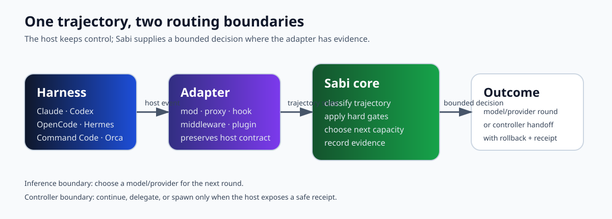

# Sabi

コーディングエージェントの軌跡に対する適応型ルーティング。

Sabi はコーディングハーネスと、それが呼び出せるモデルの間に位置します。ハーネスは自身のループ、ツール、権限、履歴、承認を保持します。Sabi はツール呼び出し、結果、失敗、コンテキスト圧力、能力、プロバイダー状態といった軌跡の証拠を用いて、次の推論またはタスク遷移を何が担当するかを選びます。

Sabi はホストに依存しないルーティング層であり、別のエージェントハーネスやエディタではありません。アダプターは各ホストが公開する実行面への任意の橋渡しです。

[English](README.md) · [Português (BR)](README.pt-BR.md) · [中文](README.zh-CN.md) · **日本語** · [한국어](README.ko.md)

[インストール](docs/install.md) · [統合](docs/adapters/README.md) · [証拠](docs/harnesses.md) · [Agent スキル](skills/sabi/SKILL.md) · [機械用索引](llms.txt)

> [!TIP]
> Sabi には2つの境界があります：推論ルーティング（ラウンドごとのモデル/プロバイダー選択）と controller ハンドオフ（継続/委譲/生成）。フックの導入はモデル切替の証明ではなく、カタログ掲載はプラン権限の証明ではなく、mock の成功は節約の証明ではありません。

## Sabi を一度だけインストール

Sabi はユーザースコープでインストールします。worktree ごとにインストールしたり、インストール時にハーネスを選んだりしません。

Claude Code、Codex、controller 連携の OpenCode ワークフローには、公開済み controller を使います：

~~~bash
npm install --global @vizuh/sabi-controller@0.1.0
sabi setup
sabi doctor
~~~

`@vizuh/sabi-controller` パッケージは `controller-v0.1.0` としてリリースされています。ローカル Sabi プロキシ経由の Hermes や OpenCode 推論には、[checkout ベースのプロキシガイド](docs/install.md)を使ってください：controller パッケージが入れるのはフックとデーモンであり、プロキシサーバーや Hermes プロファイルではありません。

インストールをユーザーのホスト AI に任せる場合は、[ホスト AI 向けインストールフロー](docs/install.ai.md)を渡してください。ハーネスと経路を明示的に尋ね、OpenRouter キーを求めるのはプロキシ経路だけです。詳細なインストール手順の正本は英語ドキュメントです。

`setup` は冪等です：デーモンと状態をユーザースコープに保ち、対応ホストを検出し、対応済みの Sabi 所有フックだけを入れ、Sabi が使えなくても通常のハーネス経路を残します。ホスト設定を変えずにデーモンだけ欲しい場合は `sabi setup --no-hooks` を使います。

インストール後は、いつものハーネスを開きます。任意の統合は、その能力が必要になったときだけ選んでください。

## ホスト AI / エージェントと使う

インストールするエージェントには [SKILL.md](skills/sabi/SKILL.md) と[機械用索引](llms.txt)を渡します。正本の[ホスト AI フロー](docs/install.ai.md)はハーネスと経路を明示的に尋ね、収集するのはプロキシ経路の OpenRouter キーだけです。セットアップは `--language=en|pt-BR|zh-CN|ja|ko` を受け付けます。EN/PT-BR 以外の対話プロンプトは英語にフォールバックします。

## 任意の統合を選ぶ

| 目的 | 統合 | Sabi の役割 | 現在の境界 |
| --- | --- | --- | --- |
| ラウンドごとにモデル＋推論 effort を切替 | [Command Code mod](docs/adapters/command-code.md) | ホストのネイティブループと購読カタログを利用 | Command Code のみ |
| 自分の資格情報でモデル/プロバイダーを切替 | [ローカルプロキシ](docs/install.md#optional-integration-local-openai-compatible-proxy) | OpenAI 互換エンドポイント経由で転送 | モデル/プロバイダーのルーティングのみ。ネイティブな推論 effort 切替なし |
| セッションや worktree 間で作業を移動 | [Controller フック](docs/adapters/README.md) | bounded な継続/委譲/生成アクションを調整 | 既存ネイティブセッション内のモデル切替なし |
| DeepSeek Harness から Sabi を使う | [DeepSeek Harness アダプター](docs/adapters/deepseek-harness.md) | DSH のネイティブなプロバイダー面経由で `sabi/sabi-code` を追加 | 推論のみ。DSH ライフサイクル支援は対象外 |
| 別のホストを追加 | [メンテナー契約](docs/maintainers.md) | アダプターの境界と必要な証拠を定義 | アダプターは第二のルーティングポリシーを作らない |

## 60秒で掴むメンタルモデル

1つのタスクが生むのは、1つのリクエストではなく軌跡です：

~~~mermaid
flowchart LR
  H["Harness keeps its loop"] --> A["Adapter translates host events"]
  A --> S["Sabi core classifies the next round"]
  S --> M["Model/provider selected"]
  M --> H
  S --> E["Decision + evidence"]
~~~

**Command Code** の軌跡はこう見えます：

| Round | 証拠 | 決定 |
| ---: | --- | --- |
| 1 | 新しい指示 | セッションモデルを維持 |
| 2 | リポジトリ検索と読み取り | Cheap ティア |
| 3 | 編集と実装 | Mid ティア |
| 4 | テスト/ビルド | Mid ティア |
| 5 | 失敗したツール結果 | Strong ティア |
| 6 | 失敗後の回復 | Strong ティア |
| 7 | 検証が通過 | Mid ティア |

プロキシクライアントでは、最初のリクエストは `first-turn` に分類され、設定されたティア（既定は mid）に振られます。ラウンド1をセッションモデルに残すのは、Command Code の継続ターンフックだけです。

Sabi はホストが公開する境界で決定します。ホストループを分岐させたり、ツールを再実行したり、権限を黙って書き換えたりしません。

## 実際に出荷されているもの

Sabi には現在2つの製品系列があります：

1. **推論アダプター。** Command Code のインプロセス mod とローカル OpenAI 互換プロキシが、推論ラウンドごとに振り分けます。
2. **Controller アダプター。** controller は対応ホストのイベントを観測し、ホストと実行レシートが安全を示す場合に、bounded な対象への継続・委譲・生成ができます。

2系列はルーティング概念と core 型を共有しますが、互換ではありません。Claude や Codex のフックはネイティブなモデル切替の証明になりません。モデルカタログの掲載はプラン権限の証明になりません。ローカル mock テストはモデル品質や節約の証明になりません。

対応は層で報告します：

- ソースとテストは、アダプターが存在し契約がテストされていることを示します。
- プロトコルテストは、実クライアントが bounded なフィクスチャでローカル Sabi エンドポイントやホスト面に到達したことを示します。
- ライブスモークテストは、承認済み・認証済み upstream を支出上限つきで実行したことを示します。
- 完了タスク評価は、固定ベースラインに対する品質とコストを測ります。

現在の証拠と制限は[ハーネス互換性](docs/harnesses.md)と各アダプターページにあります。

## 任意統合の詳細

### Command Code ネイティブ統合

Command Code の軌跡内でモデルと推論 effort を変えたい場合だけ、公開済み mod を使います：

~~~bash
cmd mods add -g npm:@vizuh/sabi-commandcode
cmd mods list
~~~

Sabi のプロバイダーキーもローカルプロキシも不要です。mod はセッションに付いた Command Code 購読をそのまま使います。検証とプラン適用の注意点は[インストールとセキュリティ](docs/install.md#optional-integration-command-code-native-mod)にあります。

### OpenAI 互換のローカルクライアント

クライアントが `baseURL` を受け付け、自分の OpenRouter・Ollama・その他プロバイダー資格情報で振り分けたい場合にプロキシを使います。これは任意の BYOK 推論面です。そのモデル/プロバイダールーティングに、Command Code mod のネイティブな推論 effort 信号はありません。[ローカルプロキシ](docs/install.md#optional-integration-local-openai-compatible-proxy)を見てください。

現在のゼロ価格 OpenRouter 品質レーンを使うには、`OPENROUTER_API_KEY`（または設定済み Sabi secrets ファイル）を用意して `sabi setup --free-quality` を実行します。Sabi はライブカタログを更新し、固定 `sabi-quality` エイリアスを追加して検証ラウンドをそこに振ります。有料ティアは維持されます。カタログ更新は可用性の証拠であり、モデル品質やプライバシーの保証ではありません。

### 余剰推論：シャドー QA

Sabi は設定済みゼロコスト固定レーンを使い、主作業を変えずに問題を見つけに行けます。最初のスライスは明示的・読み取り専用・シャドーのみです：

~~~bash
sabi surplus inventory
sabi surplus review --intent=bug-hunt
sabi surplus history
~~~

ローカル Sabi プロキシを通るのは bounded な追跡対象 diff だけです。秘密パス、秘密らしいマーカー、ツール、環境値、絶対パスは拒否されます。レシートが持つのはハッシュと件数であり、diff やモデルの主張ではありません。主張は、決定論的検証器が証明するまで助言扱いです。[余剰推論](docs/specs/surplus-inference.md)を見てください。

### Controller フック

上で入れたユーザーレベル controller は、対応する Claude Code・Codex・OpenCode・Orca ワークフローを調整できます。これはタスク/セッション面であり、既存ホストセッション内モデルを汎用的に書き換える手段ではありません。各ホストの証拠と境界は[アダプター](docs/adapters/README.md)を見てください。

Claude Code と Codex は各自の購読で動きます：Sabi は両者にフックを入れるだけで、プロバイダーの base URL・API キー・モデル上書きを書き込みません。両者への委譲は既存の購読を超える費用を生まず、Sabi の動作が両者を従量課金に変えることもありません。

`sabi updates` はエージェントが実行できる更新前チェックです：直近の npm 回答に対する導入版を報告し、Node 版・プロジェクト設定・導入済みフックパスを事前検証します。キャッシュ読み取りはオフラインです。レジストリに触れるのは `sabi updates --check` だけで、1回のチェックは24時間有効です。スクリプト向け `--json` もあります。

## ルーティングロジック

決定論的ポリシーはまず現状態を分類し、ハード制約を適用してからティアを選びます：

~~~mermaid
flowchart TD
  I["Round state: tools, results, failures, context, media"] --> C["Classify"]
  C --> P["Apply capability + transport gates"]
  P --> D["Choose cheap / mid / strong"]
  D --> J{"Ambiguous?"}
  J -- "no" --> U["Forward through host/proxy"]
  J -- "yes" --> V["Optional Jev judge over valid choices"]
  V --> U
  U --> R["Record allowlisted evidence"]
~~~

既定ポリシー：

| 状況 | ルール | 既定の行き先 |
| --- | --- | --- |
| 読み取り/検索/事務作業 | exploration | cheap |
| 編集/実装 | implementation | mid |
| テスト/ビルド/lint | verification | mid |
| 失敗したツール結果 | failure | strong |
| 立ち往生・コンテキスト圧力 | stuck / context-pressure | mid |
| レート制限・クォータ・タイムアウト | transport | transport ティア。怖そうだから強い層に上げない |
| 画像/ファイル入力 | capability | そのモダリティを宣言する最初の設定ティア |
| 要求出力が選択ティアの上限超過 | output-capacity | 要求出力を出せると*宣言した*最安ティア |

Jev は曖昧なプロキシラウンド向けの任意の意味判断です。判定者であり、ワーカーモデルではありません。タイムアウト・不正な回答・資格情報なしは決定論的ポリシーにフォールバックします。

## 見積：何が改善できるか

Sabi はまだ普遍的な節約主張を出荷していません。以下は、チェックイン済み設定の料率（USD/1M tokens、2026-09-18 検証）を使った透明な例です。キャッシュ割引・プロバイダー最低額・リトライ・任意 judge の出力は無視しています。予算に使う前に料率を再確認してください。

8ラウンドのタスクを仮定します：

| ティア | ラウンド数 | ラウンド平均 入力/出力 | 合計 token |
| --- | ---: | --- | ---: |
| Cheap | 3 | 3k / 1k | 12k |
| Mid | 4 | 5k / 2k | 28k |
| Strong | 1 | 8k / 3k | 11k |
| **合計** | **8** | n/a | **51k** |

例の料率（cheap $0.06/$0.12、mid $0.20/$1.20、strong $2/$10）で：

- 適応ミックス：約 **$0.0605**。
- 同じ 37k 入力＋14k 出力を all-strong で：約 **$0.2140**。
- all-strong に対する例示削減：**$0.1535 / 71.7%**。
- all-mid なら約 **$0.0242** です。Sabi は全タスクで固定 mid に勝つとは主張しません。要点は、証拠が正当化する分だけ strong 枠を確保することです。
- この単純な例の token 数は依然 **51k** です。Sabi が変えるのは token に付く価格と能力であり、コンテキストやツール出力を魔法で消すわけではありません。
- Strong ティア占有率は 100% から token の **21.6%** に下がります。これは振り分け配分の見積であり、品質結果ではありません。
- 設定 judge 料率 $0.042/M で 6k-token Jev 入力1回は、judge 出力/通信費の前に約 **$0.00025** を足します。ルーティング overhead はレポートで別計上です。

正確な式と表計算式の worked example は[見積と会計](docs/estimates.md)にあります。獲得すべき製品主張は、固定完了タスクセットで測ります：完了タスクあたりコスト・成功率・エスカレーション精度・レイテンシ・ルーター/judge overhead です。

## メンテナー向け

Sabi はホストの対応拡張点を薄く包むアダプターとして設計されています：

- ホストが持つもの：エージェントループ、ツール、承認、compaction、リトライポリシー、ユーザーに見えるモデル pin。
- アダプターが行うもの：検出、セッション識別、イベント/リクエスト受領、対応面経由の配送、結果観測、クリーンなアンインストール。
- 不明な能力は不明のままです。Sabi はツール・ファイル・画像・推論フィールド・構造化出力を落とす代わりに、安全でない経路を拒否します。
- ルーティングメタデータはローカル attribution であり、権限機構ではありません。Loopback が既定です。
- カタログ掲載は権限ではなく、フック導入はライブルーティングではなく、mock 成功は顧客ベンチマークではありません。

契約・証拠ラダー・フィクスチャ・ロールバック期待・第二ポリシーを作らないアダプター提案法は[メンテナーガイド](docs/maintainers.md)を見てください。

## リポジトリマップ

~~~text
packages/core/                 shared state, policy, routing, telemetry
packages/server/               local OpenAI-compatible proxy
packages/adapters/             Command Code, DeepSeek Harness, Hermes, OpenCode, Orca, Prime Agent
packages/controller/           task/session controller and host hooks
packages/evals/                frozen evals, client smoke checks, accounting
docs/adapters/                 user-facing adapter guides
docs/research/                 verified upstream evidence and release gates
~~~

参考：

- [アダプターディレクトリ](docs/adapters/README.md)
- [ハーネス証拠](docs/harnesses.md)
- [インストールとセキュリティ](docs/install.md)
- [メンテナーガイド](docs/maintainers.md)
- [見積](docs/estimates.md)
- [決定と境界](docs/decisions.md)

Sabi は MIT ライセンスです。リポジトリは https://github.com/vizuh/sabi で公開されています。

## コミュニティとセキュリティ

- [コントリビュート](CONTRIBUTING.md) — 基本則、検証ゲート、リリース手順。
- [セキュリティポリシー](SECURITY.md) — 対応バージョンと脆弱性の非公開報告。
- [決定と境界](docs/decisions.md) — 決めたこと、明示的に主張しないこと。
- [ハーネス証拠](docs/harnesses.md) — 証拠層で報告するアダプター別対応。

## アクセシビリティ

- 図には代替テキストがあります。色だけに意味を持たせていません。
- 見出しは順序どおりで、表にはヘッダー行があります。
- リンク文は行き先を示します（「こちら」のみは使いません）。
- 英語が正本です。料率・クォータ・対応の主張は英語版に従います。
