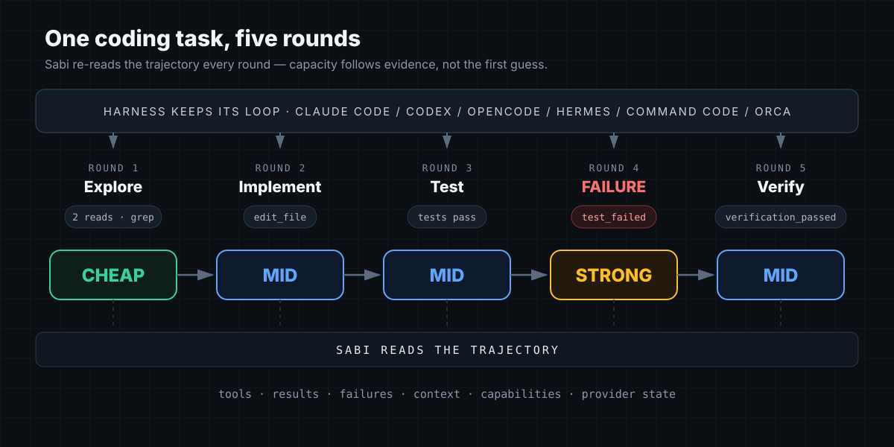
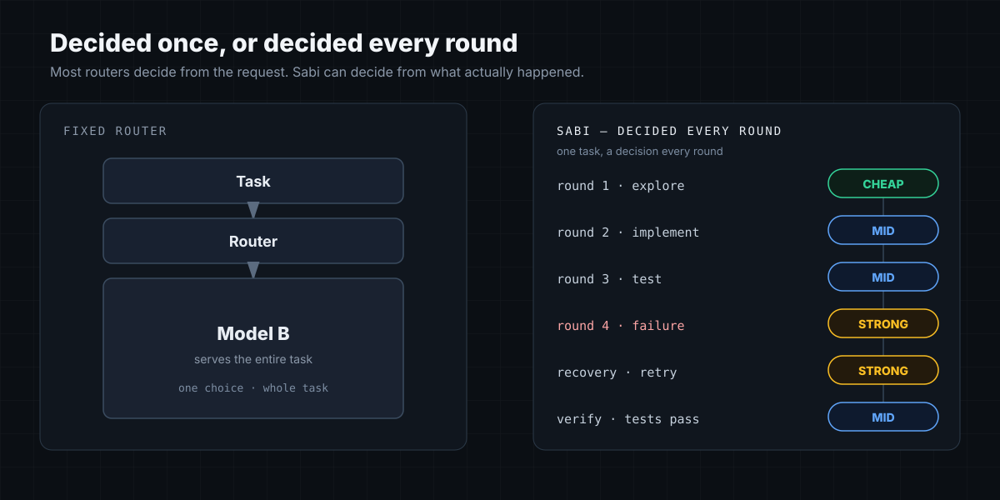
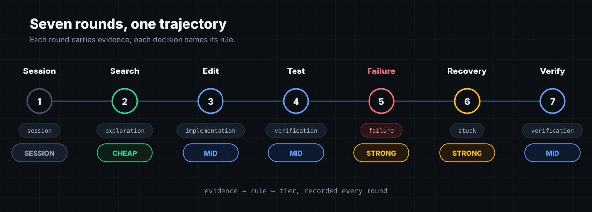
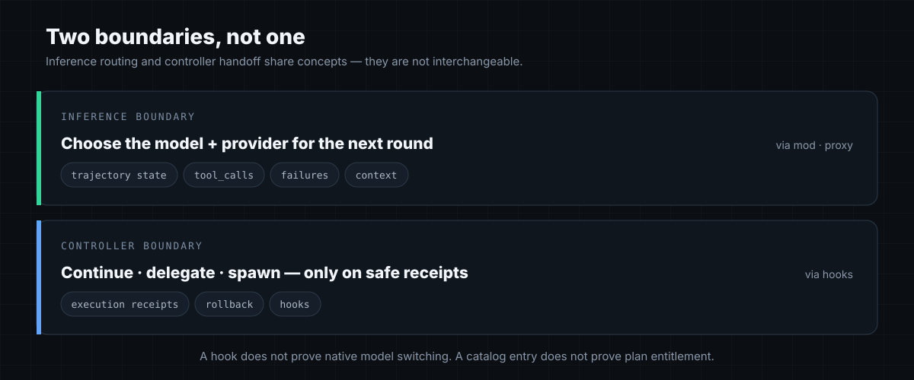

# Sabi

[](https://www.npmjs.com/package/@vizuh/sabi)
[](https://github.com/vizuh/sabi/blob/main/LICENSE)
[](https://github.com/vizuh/sabi/actions)
[](https://nodejs.org)

Adaptive routing for coding-agent trajectories.

Sabi sits between a coding harness and the models it can call. The harness keeps its own loop,
tools, permissions, history, and approvals. Sabi uses trajectory evidence such as tool calls,
results, failures, context pressure, capabilities, and provider state to choose what serves the
next inference or task transition.

Sabi is a host-agnostic routing layer, not another agent harness or editor. Adapters are optional bridges to the execution seams exposed by each host.

**English** · [Português (BR)](README.pt-BR.md) · [中文](README.zh-CN.md) · [日本語](README.ja.md) · [한국어](README.ko.md)

[Install](docs/install.md) · [Integrations](docs/adapters/README.md) · [Evidence](docs/harnesses.md) · [Agent skill](skills/sabi/SKILL.md) · [Machine index](llms.txt)

> [!TIP]
> Sabi has two boundaries: inference routing (model/provider per round) and controller handoffs (continue/delegate/spawn). A hook install is not model switching; a catalog listing is not plan entitlement; a mock pass is not a savings benchmark.



> Sabi doesn't choose one model for the task. It chooses the capacity needed for the next round.

## Install Sabi once

Sabi is installed at user scope. You do not install it per worktree or choose a harness during installation.

For Claude Code, Codex and controller-backed OpenCode workflows, install the published controller:

~~~bash
npm install --global @vizuh/sabi-controller@0.1.3
sabi setup
sabi doctor
sabi serve                         # the local proxy, http://127.0.0.1:8787/v1
~~~

The `@vizuh/sabi-controller` package is released as `controller-v0.1.3` and carries the proxy as well
as the hooks and the daemon: `sabi serve` runs the same server a checkout runs with `npm start`, from
the installed package, with no clone. Generating a Hermes or OpenCode *profile* still uses the
[setup guide](docs/install.md), because that writes host configuration rather than running a server.

If the user's current host AI is doing the installation, give it the [host-AI installation flow](docs/install.ai.md); it asks for the harness and route explicitly, and asks only for an OpenRouter key on proxy paths.

`setup` is idempotent: it keeps the daemon and state user-scoped, detects supported hosts, installs only supported Sabi-owned hooks, and keeps the normal harness path available if Sabi is unavailable. Use `sabi setup --no-hooks` when you want the daemon without changing host configuration.

After installation, open your normal harness. Choose an optional integration only when you need the capability it provides.

## Use with a host AI or agent

Install the skill with the open skills CLI — `npx skills add vizuh/sabi --skill sabi` — or hand the
installing agent [SKILL.md](skills/sabi/SKILL.md) and the [machine index](llms.txt) directly. The canonical [host-AI flow](docs/install.ai.md) asks for the harness and route explicitly and collects only an OpenRouter key on proxy paths. Setup accepts `--language=en|pt-BR|zh-CN|ja|ko`; prompts outside EN/PT-BR fall back to English. JA/KO READMEs are full mirrors; English is canonical for rates and support claims.

## Choose an optional integration

| Goal | Integration | What Sabi does | Current boundary |
| --- | --- | --- | --- |
| Per-round model + reasoning-effort routing | [Command Code mod](docs/adapters/command-code.md) | Uses the host's native loop and subscription catalog | Command Code only |
| Model/provider routing with your own credentials | [Local proxy](docs/install.md#optional-integration-local-openai-compatible-proxy) | Routes requests through an OpenAI-compatible endpoint | Model/provider routing; not native reasoning-effort switching |
| Move work between sessions and worktrees | [Controller hooks](docs/adapters/README.md) | Coordinates bounded continue/delegate/spawn actions | Does not switch the model inside an existing native session |
| Use Sabi from DeepSeek Harness | [DeepSeek Harness adapter](docs/adapters/deepseek-harness.md) | Adds `sabi/sabi-code` through DSH's native provider seam | Inference-only; DSH lifecycle support is not claimed |
| Add another host | [Maintainer contract](docs/maintainers.md) | Defines the adapter boundary and evidence required | An adapter is not a second routing policy |

## The 60-second mental model



> Most routers decide from the request. Sabi can decide from what actually happened.

One task produces a trajectory, not one request:

~~~mermaid
flowchart LR
  H["Harness keeps its loop"] --> A["Adapter translates host events"]
  A --> S["Sabi core classifies the next round"]
  S --> M["Model/provider selected"]
  M --> H
  S --> E["Decision + evidence"]
~~~



A **Command Code** trajectory might look like:

| Round | Evidence | Decision |
| ---: | --- | --- |
| 1 | New instruction | Keep the session model |
| 2 | Repository search and reads | Cheap tier |
| 3 | Edit and implementation | Mid tier |
| 4 | Tests/build | Mid tier |
| 5 | Failing tool result | Strong tier |
| 6 | Recovery after the failure | Strong tier |
| 7 | Verification passes | Mid tier |

For proxy clients, the first request is classified as `first-turn` and routed to the configured tier (mid by default). Only the Command Code continuing-turn hook leaves round 1 on the session model.

Sabi makes a decision at the boundary the host exposes. It does not fork the host loop, replay
tools, or silently rewrite permissions.

## What is actually shipped?

Sabi currently has two product families:

1. **Inference adapters.** Command Code's in-process mod and the local OpenAI-compatible proxy
   route individual inference rounds.
2. **Controller adapters.** The controller observes supported host events and can continue,
   delegate, or spawn a bounded target when the host and execution receipts make that safe.

The families share routing concepts and core types, but they are not interchangeable. A Claude or
Codex hook does not prove native model switching. A model catalog entry does not prove plan
entitlement. A local mock test does not prove model quality or savings.



Support is reported in layers:

- Source and tests show that the adapter exists and its contracts are tested.
- A protocol test shows that a real client reached a local Sabi endpoint or host seam with a bounded fixture.
- A live smoke test shows that an approved authenticated upstream was exercised under a spend cap.
- A completed-task evaluation measures quality and cost against a fixed baseline.

Current evidence and limitations live in [Harness compatibility](docs/harnesses.md) and each adapter page.

## Optional integration details

### Command Code native integration

Use the published mod only if you want Sabi to change the model and reasoning effort inside a Command Code trajectory:

~~~bash
cmd mods add -g npm:@vizuh/sabi
cmd mods list
~~~

No Sabi provider key or local proxy is needed. The mod uses the Command Code subscription already attached to the session. The full verification and plan-coverage notes are in [Install and security](docs/install.md#optional-integration-command-code-native-mod).

### Local OpenAI-compatible clients

Use the proxy when a client accepts a `baseURL` and you want Sabi to route your own OpenRouter, Ollama, or other provider credentials. This is an optional BYOK inference surface; its model/provider routing does not provide the native reasoning-effort signals of the Command Code mod. See [Local proxy](docs/install.md#optional-integration-local-openai-compatible-proxy).

To opt into a current zero-priced OpenRouter quality lane, set `OPENROUTER_API_KEY` (or use the
configured Sabi secrets file) and run `sabi setup --free-quality`. Sabi refreshes the live catalog,
adds the fixed `sabi-quality` alias and routes verification rounds there; paid tiers remain intact.
The catalog refresh is availability evidence, not a model-quality or privacy guarantee.

### Surplus inference: shadow QA

Sabi can use a configured zero-cost fixed lane to try to find a problem in the primary work without
changing it. The first slice is explicit, read-only and shadow-only:

~~~bash
sabi surplus inventory
sabi surplus review --intent=bug-hunt
sabi surplus history
~~~

Only a bounded tracked diff is sent through the local Sabi proxy. Secret paths, secret-like markers,
tools, environment values and absolute paths are refused; receipts store hashes and counts, not the
diff or model claims. A claim is advisory until a deterministic verifier proves it. See
[Surplus inference](docs/specs/surplus-inference.md).

### Controller hooks

The user-level controller installed above can coordinate supported Claude Code, Codex, OpenCode, and Orca workflows. It is a task/session surface, not a generic way to rewrite the model inside an existing host session. See [Adapters](docs/adapters/README.md) for the evidence and boundary of each host.

Claude Code and Codex run on their own subscriptions: Sabi installs hooks into them and never
writes a provider base URL, an API key or a model override into either harness. Delegating to them
therefore costs nothing beyond the subscription already in place, and nothing Sabi does can turn
either one into per-token API spend.

`sabi updates` is the pre-upgrade check an agent can run: it reports the installed version against
the last npm answer, and preflights the Node version, the project config and installed hook paths.
The cached read is offline; only `sabi updates --check` contacts the registry, and one check covers
the next 24 hours. `--json` is available for scripts.

Keeping Sabi current is the daemon's job rather than the user's memory. The daemon makes at most one
registry check per day and writes the answer to a cache every other surface reads offline;
`SABI_UPDATE_CHECK=off` turns that one request off entirely. When the registry is ahead, the
installed Claude and Codex hooks show a single line once per check window and `sabi status` reports
it. `sabi upgrade` then installs the new controller, verifies the registry signatures, refreshes the
adapter copies it owns — the OpenCode plugin is a copy in the state directory, not a link into the
bundle — and restarts the daemon.

## Borrowed authentication

Sabi can sit between a harness and the model it already talks to. The harness keeps its own
credential and keeps sending it; Sabi decides which model serves each round and forwards the request
with the credential it received, to the provider that credential belongs to. **Sabi holds no
credential on this path** — it opens no credential file, writes nothing to disk, and the only
outbound destination is the provider the harness would have called itself.

The harness speaks its own protocol, so Sabi accepts it directly: `POST /v1/messages` (Anthropic
Messages) and `POST /v1/responses` (OpenAI Responses), beside the existing
`POST /v1/chat/completions`. Only the `model` field is rewritten; streaming is forwarded frame by
frame, so the harness parses its own protocol.

```bash
# Claude Code, keeping its own subscription credential
ANTHROPIC_BASE_URL=http://127.0.0.1:8787 claude
```

```json
{
  "upstreams": { "anthropic": { "baseURL": "https://api.anthropic.com", "auth": "passthrough" } },
  "models": { "cheap": { "upstream": "anthropic", "model": "claude-haiku-4-5" },
              "mid": { "upstream": "anthropic", "model": "claude-sonnet-4-5" },
              "strong": { "upstream": "anthropic", "model": "claude-opus-4-1" } },
  "passthrough": { "alias": "sabi-code" }
}
```

An upstream declared `auth: passthrough` may not declare an `apiKey`: the credential is the
harness's, and a second one here is exactly what this mode exists to avoid. A round with no
credential on it, or a tier whose upstream holds its own key, is refused with a typed error rather
than silently routed somewhere else. See the [adapter page](docs/adapters/README.md) for which
harness exposes a base URL to repoint.

## Routing logic

The deterministic policy classifies the current state first, then applies hard constraints before
selecting a tier:

Architecture reference — host event in, bounded decision out:


~~~mermaid
flowchart TD
  I["Round state: tools, results, failures, context, media"] --> C["Classify"]
  C --> P["Apply capability + transport gates"]
  P --> D["Choose cheap / mid / strong"]
  D --> J{"Ambiguous?"}
  J -- "no" --> U["Forward through host/proxy"]
  J -- "yes" --> V["Optional Jev judge over valid choices"]
  V --> U
  U --> R["Record allowlisted evidence"]
~~~

Default policy:

| Situation | Rule | Default target |
| --- | --- | --- |
| Read/search/bookkeeping | exploration | cheap |
| Edit/implementation | implementation | mid |
| Test/build/lint | verification | mid |
| Failing tool result | failure | strong |
| Stuck or context pressure | stuck / context-pressure | mid |
| Rate limit, quota, timeout | transport | transport tier; never escalate because it looks scary |
| Image/file input | capability | first configured tier that declares the modality |
| Requested output above the chosen tier's ceiling | output-capacity | cheapest tier that *declares* it can serve the requested output |

Jev is optional semantic judgment for ambiguous proxy rounds. It is a judge, not a worker model.
Timeouts, invalid answers, and unavailable credentials fall back to deterministic policy.

## Estimates: what can improve?

Sabi is not shipping a universal savings claim yet. The following is a transparent example using
the rates in the checked-in configuration (USD per 1M tokens, verified 2026-09-18). It ignores
cache discounts, provider minimums, retries, and output generated by the optional judge. Recheck
rates before using it for a budget.

Assume an eight-round task:

| Tier | Rounds | Average input/output per round | Total tokens |
| --- | ---: | ---: | ---: |
| Cheap | 3 | 3k / 1k | 12k |
| Mid | 4 | 5k / 2k | 28k |
| Strong | 1 | 8k / 3k | 11k |
| **Total** | **8** | n/a | **51k** |

Using the example rates (cheap $0.06/$0.12, mid $0.20/$1.20, strong $2/$10):

- Adaptive mix: about **$0.0605**.
- All-strong at the same 37k input + 14k output: about **$0.2140**.
- Illustrative reduction against all-strong: **$0.1535 / 71.7%**.
- All-mid would be about **$0.0242**, so Sabi is not claiming it beats a fixed mid model on every
  task. The point is to reserve strong capacity for evidence that justifies it.
- Token count in this simple example is still **51k**. Sabi changes the price and capability
  assigned to those tokens; it does not magically remove context or tool output.
- Strong-tier share falls from 100% to **21.6% of tokens**. That is a routing allocation estimate,
  not a quality result.
- One 6k-token Jev input at the configured $0.042/M judge rate adds roughly **$0.00025** before
  judge output/network costs. The report counts routing overhead separately.

The exact formulas and a worked spreadsheet-style example are in
[Estimates and accounting](docs/estimates.md). The production claim to earn is measured on a
fixed completed-task set: cost per completed task, success, escalation precision, latency, and
router/judge overhead.

## For maintainers

Sabi is designed to be a thin adapter around a host's supported extension point:

- The host owns the agent loop, tools, approvals, compaction, retry policy, and user-visible model pin.
- An adapter detects, identifies a session, receives an event/request, dispatches through a supported
  seam, observes an outcome, and uninstalls cleanly.
- Unknown capabilities remain unknown. Sabi refuses unsafe routes instead of dropping tools, files,
  images, reasoning fields, or structured output.
- Routing metadata is local attribution, not a permission mechanism. Loopback is the default.
- A catalog listing is not entitlement; a hook installation is not live routing; a mock pass is not
  a customer benchmark.

See [Maintainer guide](docs/maintainers.md) for the contract, evidence ladder, fixtures, rollback
expectations, and how to propose an adapter without creating a second policy implementation.

## Repository map

~~~text
packages/core/                 shared state, policy, routing, telemetry
packages/server/               local OpenAI-compatible proxy
packages/adapters/             Command Code, DeepSeek Harness, Hermes, OpenCode, Orca, Prime Agent
packages/controller/           task/session controller and host hooks
packages/evals/                frozen evals, client smoke checks, accounting
docs/adapters/                 user-facing adapter guides
docs/research/                 verified upstream evidence and release gates
~~~

Useful references:

- [Adapter directory](docs/adapters/README.md)
- [Harness evidence](docs/harnesses.md)
- [Install and security](docs/install.md)
- [Maintainer guide](docs/maintainers.md)
- [Estimates](docs/estimates.md)
- [Decisions and boundaries](docs/decisions.md)

Sabi is MIT licensed. The repository is public at https://github.com/vizuh/sabi.

## Community and security

- [Contributing](CONTRIBUTING.md) — ground rules, verification gates, release procedure.
- [Security policy](SECURITY.md) — supported versions and private vulnerability reporting.
- [Decisions and boundaries](docs/decisions.md) — what was decided, what is explicitly unclaimed.
- [Harness evidence](docs/harnesses.md) — per-adapter support, reported as evidence layers.
