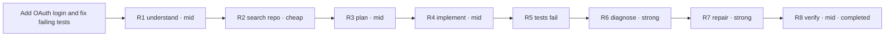
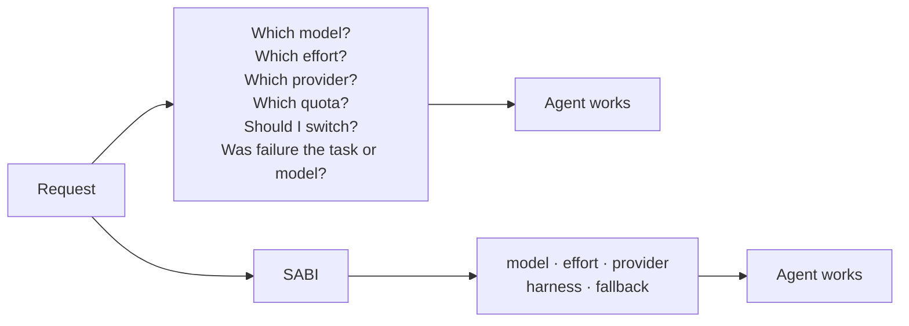
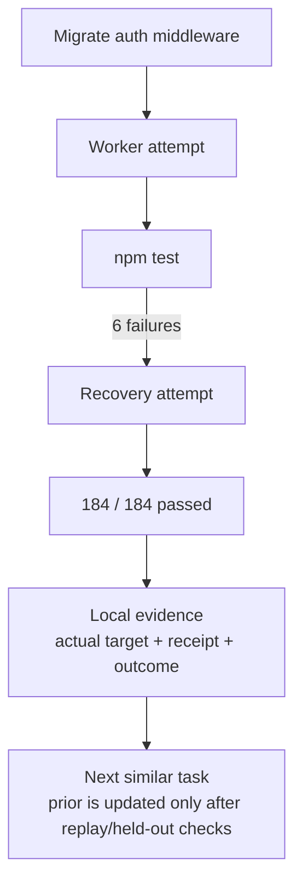
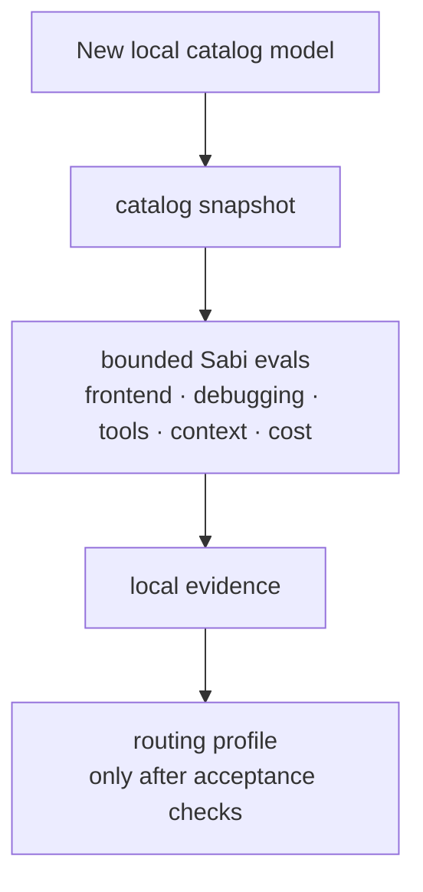
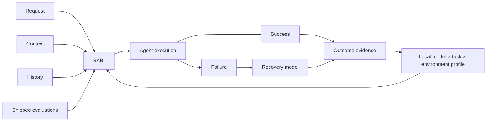

# Sabi visual story

Status: narrative brief for the repository and future product surface. Examples below are
illustrative unless they carry an explicit observed-evidence label. Do not turn them into benchmark
claims.

## Core memory

> Sabi is the inference scheduler that learns your development environment.

The first version of the story should show delegation of model choice and accumulated local
evidence. Cost is a later consequence, not the hero claim.

## Hero: one coding session, many models



Caption: **One agent. One task. Sabi handles the model decisions.**

If real model names are shown, label the trace with its harness, catalog snapshot, date and
observed outcome. A future trace may show `gpt-5.6-luna`, `opencode-go/kimi-k3` or another local
catalog id; the names must come from a receipt, not a designed example.

## Cognitive load: without and with Sabi



Headline: **Your job is the code. Sabi's job is deciding what should run it.**

## Local capability heatmap

Use this only after enough local receipts exist. It is not a universal benchmark and must not use
bare model scores:

| Observed task | Model A | Model B | Model C | Evidence attached |
|---|---:|---:|---:|---|
| frontend implementation | — | — | — | `n` successful rounds; `n` recovered failures |
| repository exploration | — | — | — | repository + harness + catalog snapshot |
| TypeScript debugging | — | — | — | outcome and test receipt |
| architecture | — | — | — | held-out replay result |
| tool reliability | — | — | — | transport/error receipt |

Every non-empty cell should expand to: model id, harness, repository scope, observation window,
successful rounds, recovered failures, unknown fields and confidence. “Unknown” is a valid result.

## Failure → recovery → memory



The visual should show a real execution receipt when one exists. It should never imply that a
successful test run proves the model caused the success, or that one failure proves a global model
ranking.

## Confidence over time

The defensible metric is decisions backed by local evidence, not “quality goes up”:

```text
decisions backed by local evidence
100% |                         ┌────
 75% |                    ┌────┘
 50% |               ┌────┘
 25% |──────────┌────┘
     +--------------------------------
       0     50    100    250    500 agent runs
```

The line is a design placeholder until the denominator, evidence definition, and held-out
evaluation are implemented. Labels should progress from defaults + shipped evals to observed
outcomes, repository evidence and user habits.

## New model arrives



Message: **Models change faster than you should have to think about them.**

Catalog presence is not plan entitlement, price, quota, health or quality. Those dimensions need
separate receipts.

## End-state image



This is the product direction, not a claim that the learning loop is shipped today.

## Proof rules for any published visual

1. Mark illustrative traces as illustrative.
2. Attach runtime version, catalog hash, harness, repository scope and date to observed traces.
3. Keep token, cost, latency and quality unknown when the host did not provide a receipt.
4. Separate source/tests, package installation, live activation, execution and human acceptance.
5. Do not publish “60% cheaper”, “98% quality” or a model skill score until a reproducible,
   held-out comparison exists.
